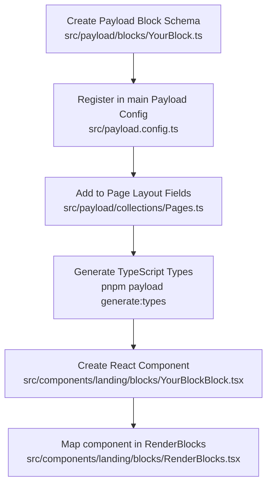

# TASTO Page Builder Block Developer Guide

This guide details how to create and register custom UI blocks in the **TASTO** landing page builder. It details the file creation/modification workflow, theme styling tokens, reusable layout components, and animation patterns to maintain design consistency across the codebase.

---

## 🛠️ Step-by-Step Block Creation Workflow

Creating a new landing page block involves registering a schema in Payload CMS, generating TypeScript types, and implementing the front-end React component.



### 1. Files to Create

- **Payload Schema:** `src/payload/blocks/[BlockName].ts` (e.g. `src/payload/blocks/FeatureHighlight.ts`)
  - Defines fields, labels, defaults, and layouts editable inside the CMS admin panel.
- **React Component:** `src/components/landing/blocks/[BlockName]Block.tsx` (e.g. `src/components/landing/blocks/FeatureHighlightBlock.tsx`)
  - Implements the actual client-side visual layer using Tailwind, Framer Motion, and design system components.

### 2. Files to Modify

- **`src/payload.config.ts`:** Register the block schema in the main `blocks` array of the build config.
- **`src/payload/collections/Pages.ts`:** Add the block schema to the `layout` blocks array so admins can add it to custom pages.
- **`src/components/landing/blocks/RenderBlocks.tsx`:** Import the new React component and add a `case "[slug]":` statement mapping the block type slug to the component.

---

## 🎨 Theme & Design System

The TASTO design system operates under two distinct theme backgrounds: **Dark Sections** (cinematic, tech-focused) and **Light Sections** (clean, executive focus).

### 1. Section Theme Classes

Use the following classes at the root of your block wrapper:

| Theme           | Background Class             | Text Class         | Main Target Audience / Mood                              |
| :-------------- | :--------------------------- | :----------------- | :------------------------------------------------------- |
| **Dark Theme**  | `bg-tasto-bg` (`#0b1020`)    | `text-tasto-white` | Hero, Platform Architecture, Operational Governance, CTA |
| **Light Theme** | `bg-tasto-white` (`#f5f5f5`) | `text-tasto-black` | Strategic Problem Section, Strategic Trust Metrics       |

### 2. Tailwind Brand Colors & CSS Variables

Ensure you use Tailwind v4 brand classes mapping to custom tokens in `globals.css`:

- **Colors:**
  - `bg-tasto-bg` / `text-tasto-bg` — Primary deep dark background
  - `bg-tasto-black` / `text-tasto-black` — Charcoal dark theme text / light theme background
  - `bg-tasto-white` / `text-tasto-white` — Ice white background / dark theme text
  - `bg-tasto-blue` / `text-tasto-blue` — Brand blue accent color (typically for light theme highlights)
  - `bg-tasto-cyan` / `text-tasto-cyan` — Brand glowing cyan accent (typically for dark theme glows and details)
- **Typography:**
  - `font-sans` (`var(--font-sans)`) — Standard body copy, cards, navigation text.
  - `font-display` (`var(--font-display)`) — Large headlines, H1 elements, card numbers, stats, and logo typography.

---

## 🧱 Reusable UI Components & Utilities

Avoid writing custom typography, glows, or animation wraps. Use the pre-built UI components located in `@/components/ui/` and `src/components/landing/layout/`:

### 1. `GridPattern`

Renders the grid pattern used in section backgrounds.

- **Usage:** `<GridPattern />` (renders standard dark theme grids) or `<GridPattern variant="light" />` (renders dark grid lines for light theme sections).

### 2. `AmbientGlows`

Provides the premium background glowing orbs.

- **Usage:** `<AmbientGlows withAccents size="lg" />`
- **Best Practices:** Only use in **Dark Theme** sections (`bg-tasto-bg`) to prevent color washed/flat looks.

### 3. `SectionHeading`

Dynamic heading wrapper with custom gradients.

- **Props:**
  - `as`: `"h1" | "h2" | "h3"` (default: `"h2"`)
  - `variant`: `"dark" | "light"` (defaults to `"dark"` which uses white gradient text; `"light"` uses black gradient text)
- **Usage:** `<SectionHeading variant="light" as="h2">Strategic Trust</SectionHeading>`

### 4. `SectionDescription`

Standard body paragraph with appropriate theme opacity.

- **Props:** `variant: "dark" | "light"` (dark text theme has light opacity; light text theme has dark opacity).
- **Usage:** `<SectionDescription variant="dark">Build systems on trust.</SectionDescription>`

### 5. `BrandText`

Formats normal text strings and injects the official **TASTO** logo component automatically.

- **Usage:** `<BrandText text={description} />`
- **Action:** Splitting strings on `"TASTO"` and injecting `<FullLogo />`. Always pass CMS description text fields through this.

### 6. `Eyebrow`

Glowing badge labels to introduce a section.

- **Props:** `variant: "cyan" | "blue"` (default is `"cyan"` for dark themes, use `"blue"` for light themes).
- **Usage:** `<Eyebrow variant="cyan">Operational Integrity</Eyebrow>`

### 7. `SectionReveal`

Controls scroll-reveal fade & rise.

- > [!IMPORTANT]
  > **Avoid Wrapping Top-Level Section Containers:** To prevent background color flashing when scrolling into a section, never place `SectionReveal` as the outer-most element of a block. Wrap the interior content container instead.
- **Usage:**
  ```tsx
  export const MyBlock = () => (
    <section className="bg-tasto-bg relative">
      <SectionReveal className="container mx-auto px-4">{/* content */}</SectionReveal>
    </section>
  );
  ```

### 8. `LucideIcon`

Renders an SVG icon by its text slug dynamically.

- **Usage:** `<LucideIcon name="Shield" className="h-5 w-5 text-tasto-cyan" />`
- **Select list options:** Import `lucideIconOptions` from `src/payload/blocks/icons.ts` for block schema icon selectors.

### 9. `Button`

Brand action buttons.

- **Variants:**
  - `variant="dark-default"`: Glowing outline + transparent cyan backdrop (Dark theme primary).
  - `variant="dark-outline"`: Standard grey border + translucent fill (Dark theme secondary).
  - `variant="cyan"`: Solid cyan background + black text (High prominence Dark theme CTA).
  - `variant="default"`: Brand blue background + white text (Light theme primary).
  - `variant="outline"`: Simple thin grey border + hover fill (Light theme secondary).
- **Sizes:** `xl` (12px height) and `xxl` (14px height) are preferred for sections/CTA button scale.

---

## 📝 Code Templates

### 1. Payload Schema Schema Template (`src/payload/blocks/FeatureHighlight.ts`)

```typescript
import { Block } from "payload";
import { lucideIconOptions } from "./icons";

export const FeatureHighlight: Block = {
  slug: "feature-highlight",
  labels: {
    singular: "Feature Highlight",
    plural: "Feature Highlights",
  },
  fields: [
    {
      name: "eyebrow",
      type: "text",
      defaultValue: "Enterprise Capability",
    },
    {
      name: "heading",
      type: "text",
      required: true,
    },
    {
      name: "description",
      type: "textarea",
      required: true,
    },
    {
      name: "icon",
      type: "select",
      options: lucideIconOptions,
      defaultValue: "Shield",
      required: true,
    },
  ],
};
```

### 2. Front-End Component Template (`src/components/landing/blocks/FeatureHighlightBlock.tsx`)

```tsx
"use client";

import React from "react";
import { motion } from "motion/react";
import type { FeatureHighlight as FeatureHighlightType } from "@/payload-types";
import { GridPattern } from "@/components/ui/grid-pattern";
import { AmbientGlows } from "@/components/ui/ambient-glows";
import { SectionHeading } from "@/components/ui/section-heading";
import { SectionDescription } from "@/components/ui/section-description";
import { SectionReveal } from "@/components/ui/section-reveal";
import { LucideIcon } from "@/components/ui/lucide-icon";
import { BrandText } from "../layout/brand-formatter";
import Eyebrow from "../layout/eyebrow";

// Premium Bezier easing curve (easeOutExpo)
const containerVariants = {
  hidden: { opacity: 0, y: 30 },
  visible: {
    opacity: 1,
    y: 0,
    transition: {
      duration: 0.8,
      ease: [0.16, 1, 0.3, 1] as const,
    },
  },
};

export const FeatureHighlightBlock: React.FC<FeatureHighlightType> = ({
  eyebrow,
  heading,
  description,
  icon,
}) => {
  return (
    <section className="relative overflow-hidden bg-tasto-bg text-tasto-white py-24">
      {/* Background decoration */}
      <GridPattern />
      <AmbientGlows withAccents />

      {/* Animation reveal wrapper (Inner container only to prevent bg flashing) */}
      <SectionReveal className="container relative z-10 mx-auto px-4">
        <motion.div
          variants={containerVariants}
          initial="hidden"
          whileInView="visible"
          viewport={{ once: true, amount: 0.2 }}
          className="flex flex-col items-center text-center max-w-3xl mx-auto"
        >
          {/* Eyebrow badge */}
          {eyebrow && (
            <Eyebrow variant="cyan" className="mb-6">
              {eyebrow}
            </Eyebrow>
          )}

          {/* Icon */}
          <div className="flex h-12 w-12 items-center justify-center rounded-full bg-tasto-cyan/10 border border-tasto-cyan/20 mb-6">
            <LucideIcon name={icon || "Shield"} className="h-6 w-6 text-tasto-cyan" />
          </div>

          {/* Heading with brand formatter support */}
          <SectionHeading variant="dark" as="h2">
            <BrandText text={heading} />
          </SectionHeading>

          {/* Description */}
          <SectionDescription variant="dark" className="mt-6 max-w-xl">
            <BrandText text={description} />
          </SectionDescription>
        </motion.div>
      </SectionReveal>
    </section>
  );
};
```

### 3. Component Mapper Registry Template (`src/components/landing/blocks/RenderBlocks.tsx`)

```diff
  import { StrategicTrustBlock } from "./StrategicTrustBlock";
+ import { FeatureHighlightBlock } from "./FeatureHighlightBlock";

  // ...

  switch (block.blockType) {
    case "hero":
      return <HeroBlock key={key} {...block} />;
+   case "feature-highlight":
+     return <FeatureHighlightBlock key={key} {...block} />;
```
